# 3DTouch/Bltouch Installation Guide

## Firmware Configuration

If you want to use 3DTouch or Bltouch , you need to config Marlin firmware. Comment FIX_MOUNTED_PROBE and uncomment BLTOUCH in configuration.h file

//#define FIX_MOUNTED_PROBE

#define BLTOUCH

Then compile and upload the firmware.

## Print 3DTouch/BLtouch Dock

The STL file is in this folder , its name is "BLtouch Dock.stl".

## Installation Guide

### Material

The picture below shows what we need to finish this installation. Extra , you need a knife to cut the ribbon. 

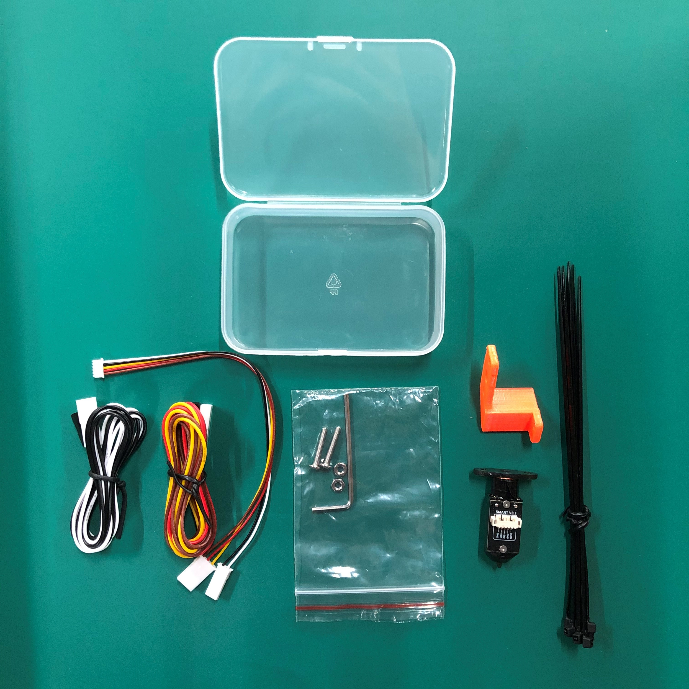

### Uninstall extruder 

Unscrew extruder either side screws

  

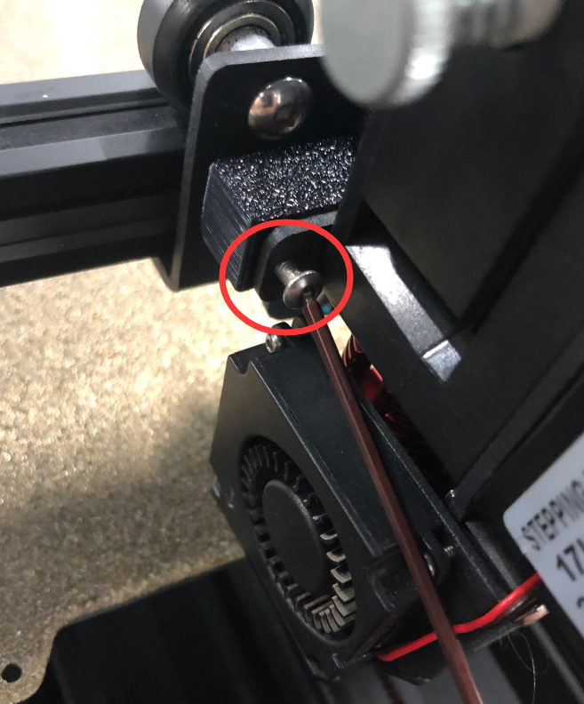

### Uninstall probe

Remember to plug it out from the motherboard

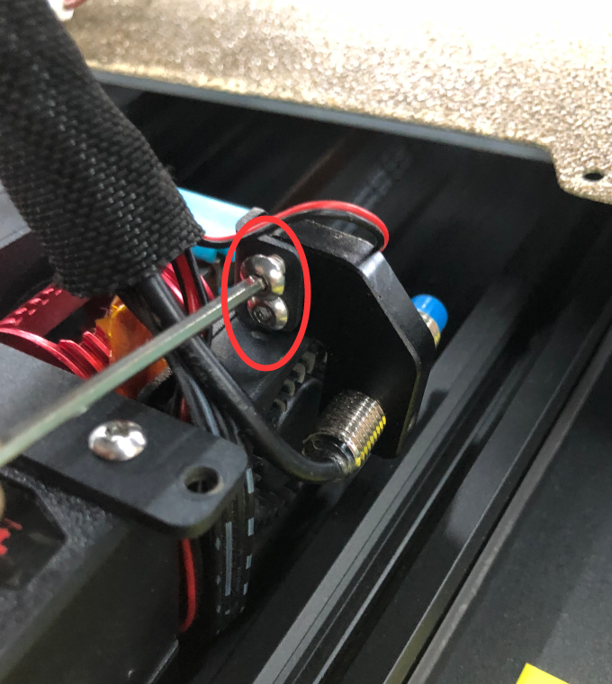

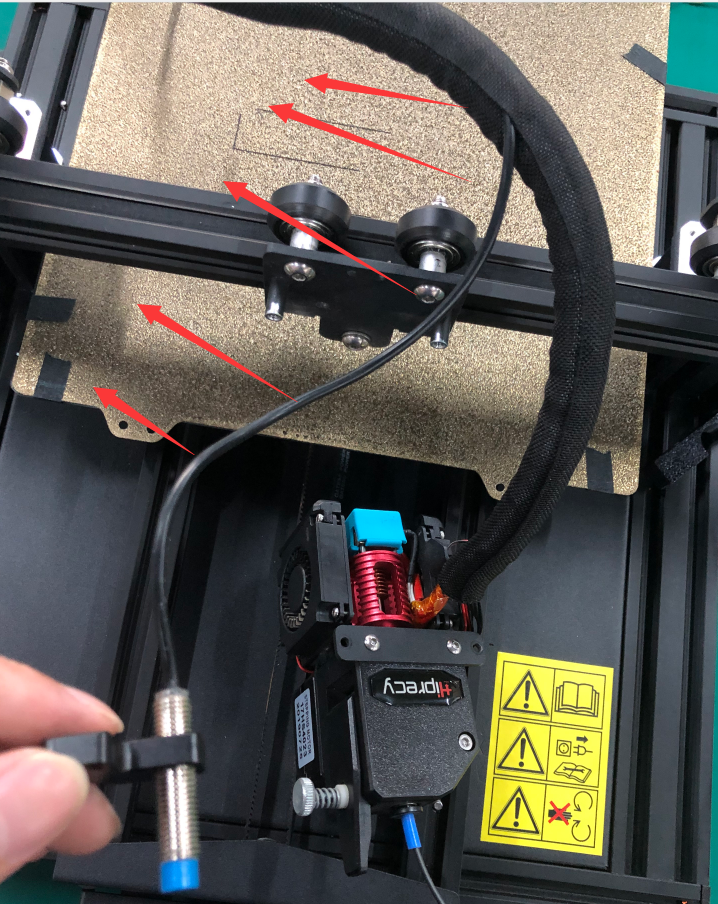

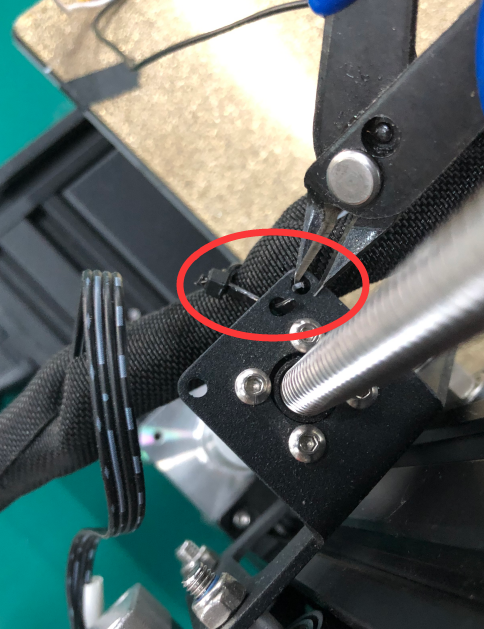

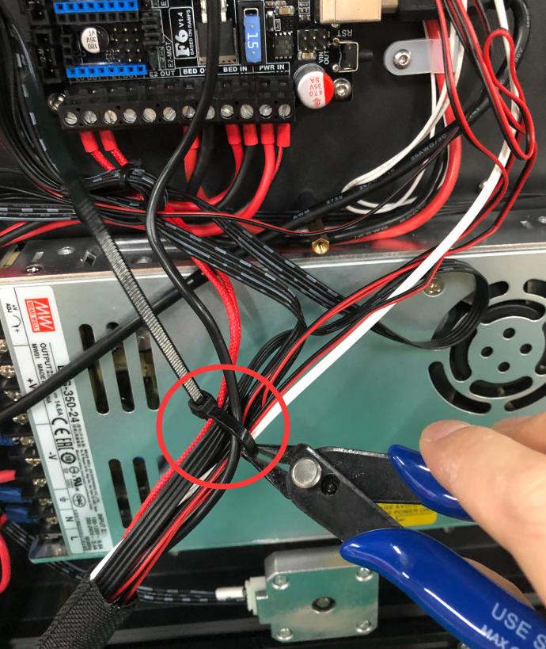

### Assemble 3DTouch/Bltouch

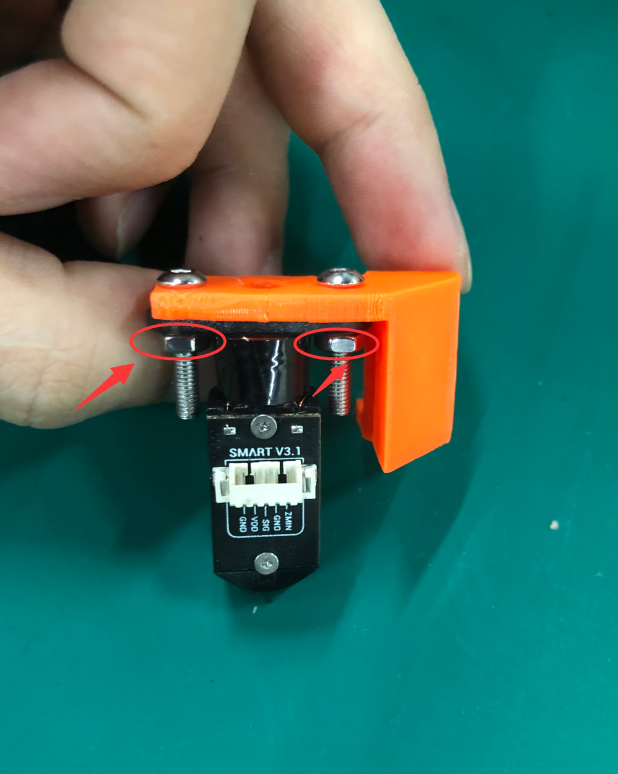

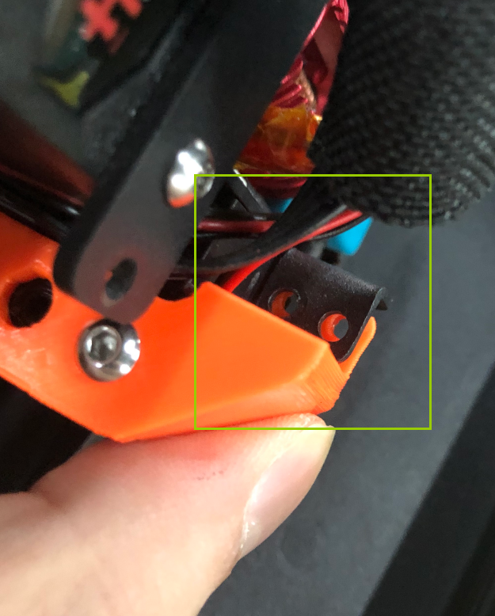

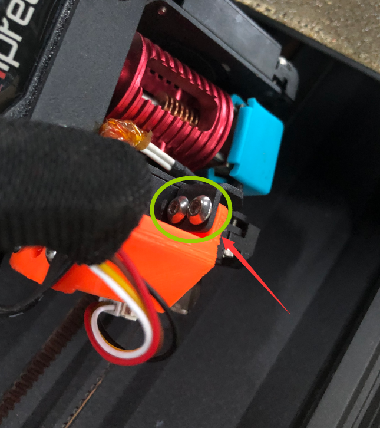

### 3DTouch/Bltouch Wiring

Assemble the extension cord (the white part shows), and put the cable into braided hose.

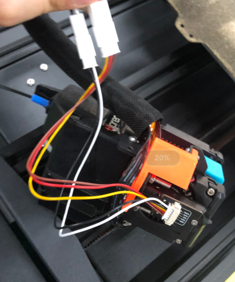

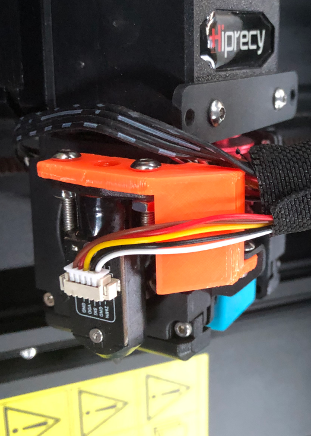

### Switch cable order

As the cable order in 3DTouch/Bltouch is different from the board servo pins , we need to do this extra work.

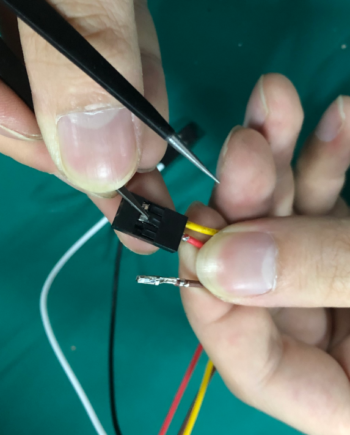

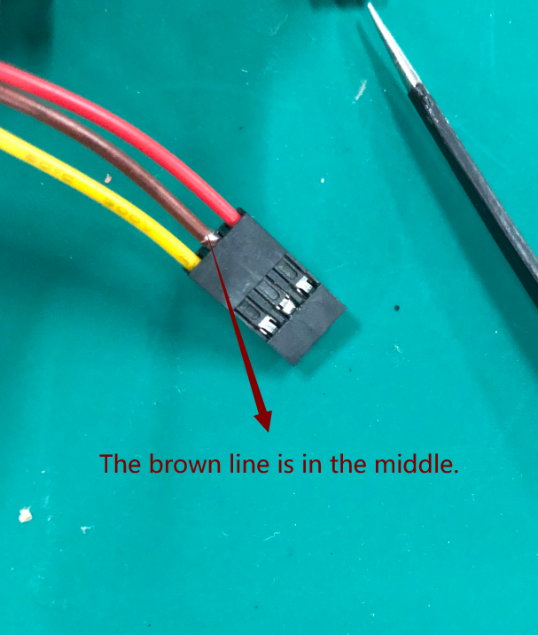

### Motherboard wiring

Wire the cable to the mother board , pay attention to the cable color and its position. You need to double check the cable orders , from left to right are (VDD GND SIG).

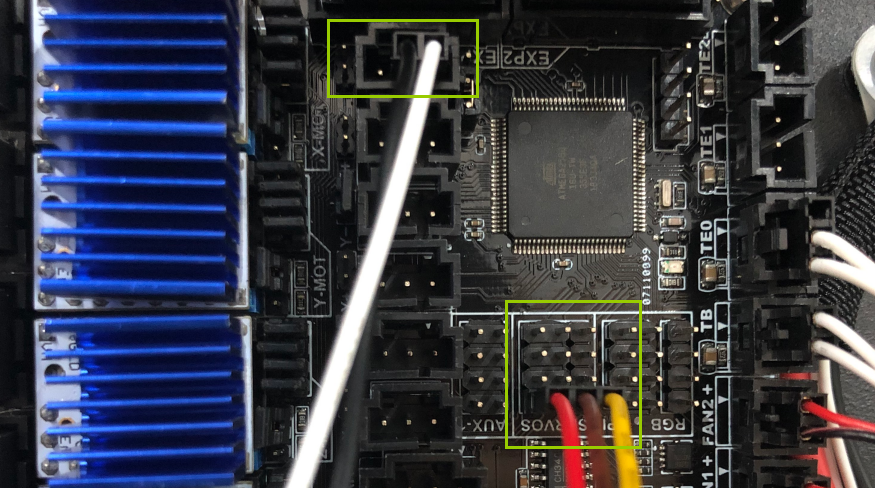

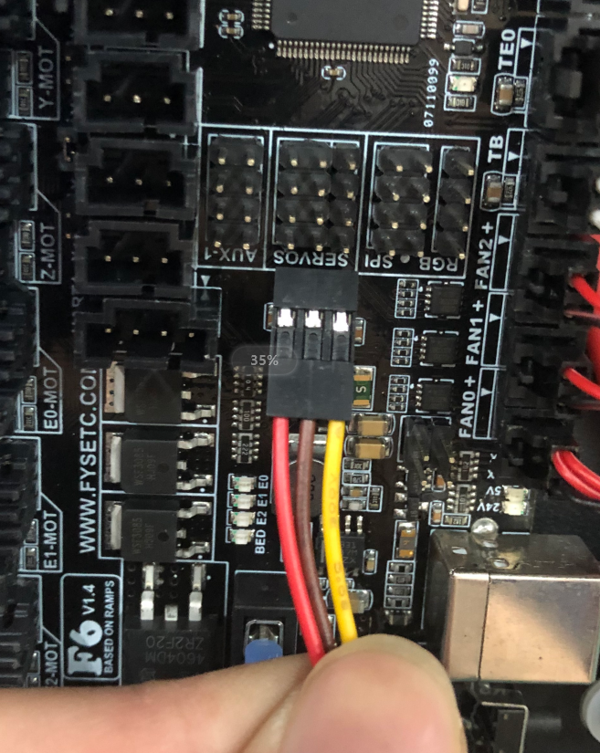

### Arrange cables

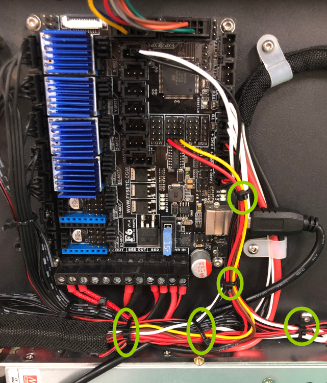

### Install extruder

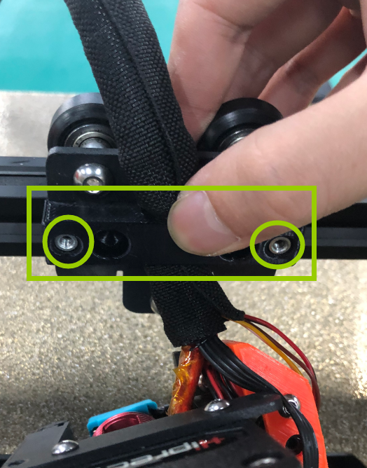

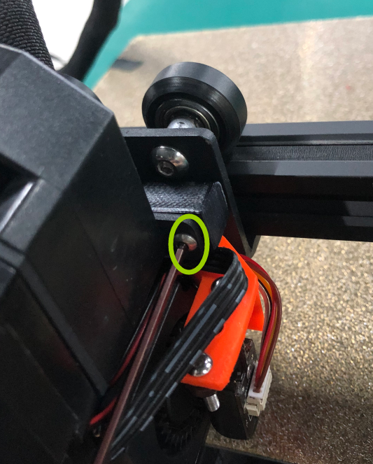

### Fix extruder cable

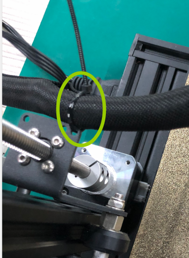

### Done ! Congratulation ! 

## Note

As you can see , we test with the 3DTouch from FYSETC , so we recommend to use it:

https://www.aliexpress.com/item/32914352952.html?spm=a2g0o.productlist.0.0.359b2be7LzeP8K&algo_pvid=87206f20-28e8-4088-a71f-8d0e848c5695&algo_expid=87206f20-28e8-4088-a71f-8d0e848c5695-0&btsid=0bb47aa615888455642068451e019c&ws_ab_test=searchweb0_0,searchweb201602_,searchweb201603_

You also can choose Bltouch from :

https://www.antclabs.com/store