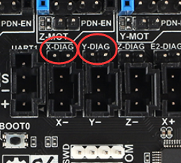

# FYSETC S6 Installation Guide

There are <u>**4**</u> options  for you  to install FYSETC S6 motherboard  for HiPrecy LEO machine.

But first of all , i need to mention that we USE FYSETC S6 V2.0 board which we have priority to use for LEO. And you can use S6 v1.2 board , but LEO only 

support TMC2209s for this board.

## Notice

In the installation video , we forget to close the X-DAIG and Y-DIAG dumpers , please  close them.



## Options

So firstly let me show you the 4 options we provide you. See the video [here](https://www.youtube.com/watch?v=JwpbHcIDuRg).

### Option A

This option is the simplest way to finish installation. It is for those who want to avoid complicate operation or those who are worry about destroying the machine when doing installing operations. 

You need the list below and you can find it [here](https://www.aliexpress.com/item/1005001388620584.html?spm=5261.ProductManageOnline.0.0.42fb4edffQhUC1).

1. SD Module 4050 v1.0
2. Touch screen
3. S6 v2.0 board
4. Screen cable
5. A print model
6. 4 * plastic gaskets

You can follow the [video](https://youtu.be/N2eGN87d1bs) here to finish the installation.

### Option B

In option B , it's almost the same as option A ,but we assume that you already have the S6 board yourself.

You need the list below and you can find it [here](https://www.aliexpress.com/item/1005001388620584.html?spm=5261.ProductManageOnline.0.0.42fb4edffQhUC1).

1. SD Module 4050 v1.0
2. Touch screen
3. Screen cable
4. A print model
5. 4 * plastic gaskets

You can follow the [video](https://youtu.be/N2eGN87d1bs) here to finish the installation.

### Option C

In this option, we assume that you want to use S6 v2.0 board to avoid TMC2130s issues but you want to use your stock screen. Please make sure you got the skills to do this. You need the list below, and you can find it [here](https://www.aliexpress.com/item/1005001388620584.html?spm=5261.ProductManageOnline.0.0.42fb4edffQhUC1).

1. SD Module 4050 v1.0
2. S6 v2.0 board
3. Screen cable
4. A print model
5. 4 * plastic gaskets

First you need to replace the sd module with new sd module. You can follow this [video](https://www.youtube.com/watch?v=Uad3ZhkHbRU).

Now you get the new screen module now, so you can follow this [video](https://youtu.be/N2eGN87d1bs) to finish the installation.

### Option D

In this option, we assume that you already have a  FYSETC S6 board and want to use the stock screen to finish installation. But you'd better see all below video guides before you start. You need the list below, and you can find it [here](https://www.aliexpress.com/item/1005001388922186.html?spm=5261.ProductManageOnline.0.0.6d274edfaUbvHV).

1. SD Module 4050 v1.0

2. Screen cable

3. A print model

4. 4 * plastic gaskets

First you need to replace the sd module with new sd module. You can follow this [video](https://www.youtube.com/watch?v=Uad3ZhkHbRU).

Now you get the new screen module now, so you can follow this [video](https://youtu.be/N2eGN87d1bs) to finish the installation.

## Firmware

If you finish S6 board installation, then you need to use the new firmware for the machine. You can get it [here](https://github.com/HiPrecy/Firmware-HiPrecy/tree/LEO/2.0.x-S6).

### Compile

Firstly if you use S6 2.0 board , you need to change the board type ```BOARD_FYSETC_S6``` to ```BOARD_FYSETC_S6_V2_0``` in ```configuration.h file```.

Secondly you need to install [vscode](https://code.visualstudio.com/) and [platformio](https://platformio.org/). 

Then you can follow the [FYSETC wiki](https://wiki.fysetc.com/FYSETC_S6/) to compile the firmware(in ```Compile the firmware``` part, search it). Or you can follow the [video](https://www.youtube.com/watch?v=jctbREgrldM). 

### Upload

[FYSETC wiki](https://wiki.fysetc.com/FYSETC_S6/) have the firmware upload part. And i think it's more easy for you to update the firmware using SD card. You just need to

1. Copy the compile output file ```firmware.bin``` to your SD card(normally it stays at ```YOUR_FRIMWARE_LOCATE\.pio\build```)
2. Power off LEO
3. Insert the SD card to LEO right side SD slot.
4. Power on LEO and wait for the splash screen

Here we go!


