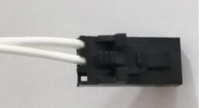
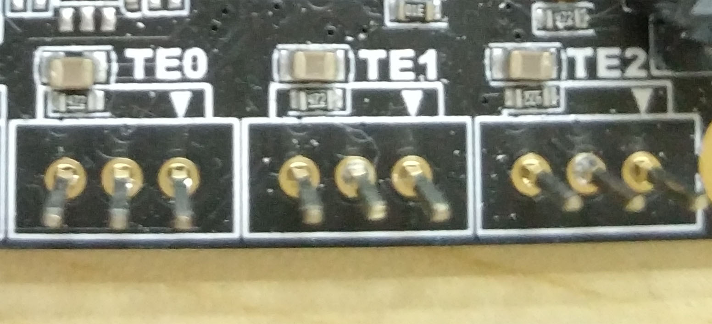

# Seal hotend Installation Guide

We make a video to show you the process , before that you need to know that you need a new thermistor to replace. Below is the parameter of the thermistor.

| Item            | Parameters                               |
| --------------- | ---------------------------------------- |
| model           | HT-NTC100K Thermistor Temperature Sensor |
| length          | at least 1m , 1.2m is proper             |
| head shell size | diameter : 3mm  length : 10~16mm         |

And the thermistor connector need to be like this:

Note:

If your thermistor connector is different(for example two pins connector) and you don't want to change it. You can pull out the board connector like i do, then connect it to left two pin.

Now you can follow the video to finish the installation: 

https://youtu.be/JH-9JEF37pk